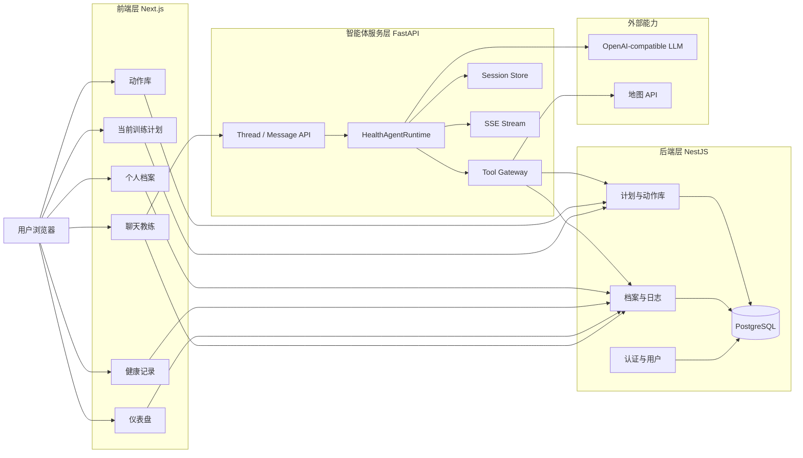
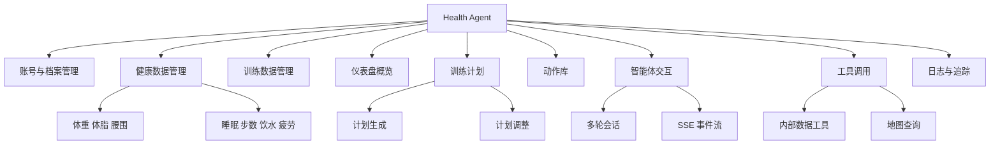
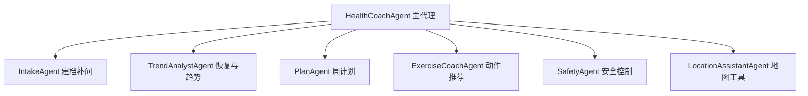
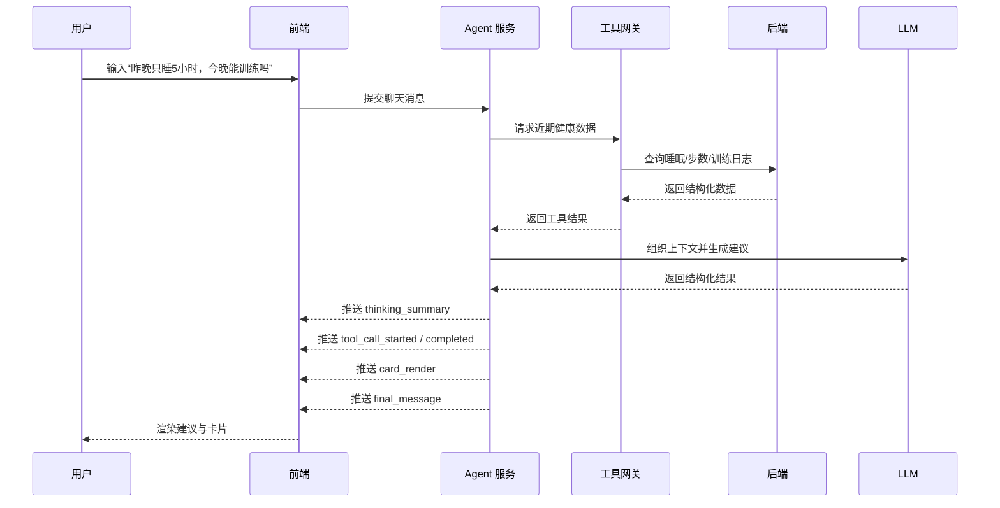
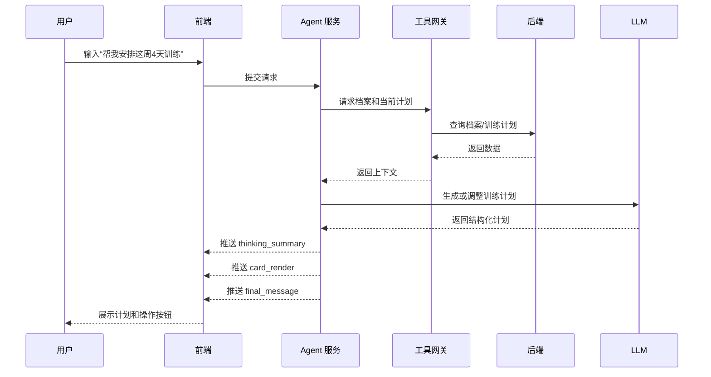
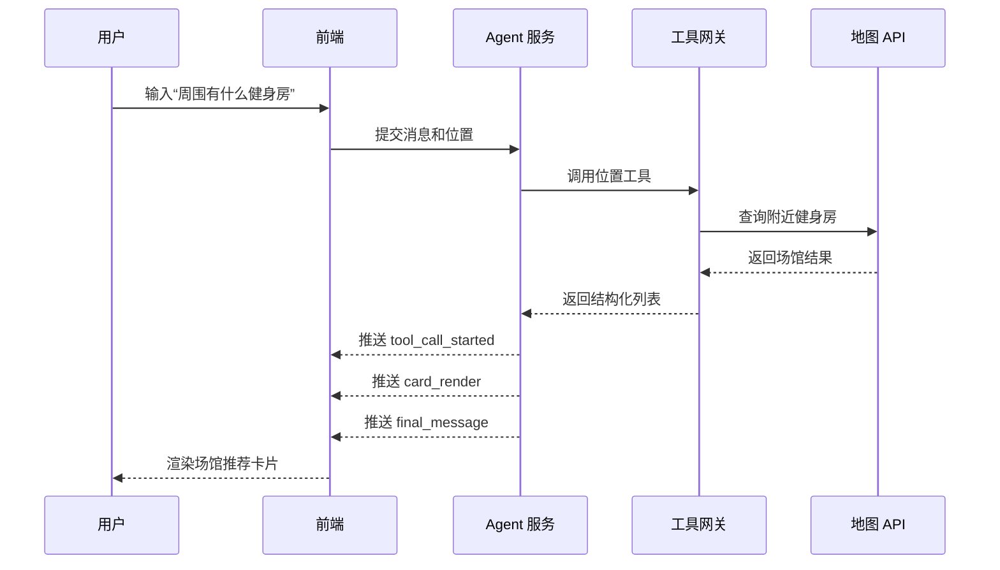
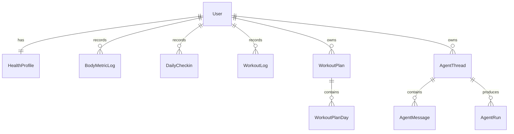

# Health Agent 系统设计说明书

## 一、引言

### 1.1 编写目的

本文档用于说明 `Health Agent` 的 MVP 系统设计方案，重点覆盖系统总体架构、前后端职责划分、智能体协作关系、前端页面结构、SSE 事件流设计、接口设计以及数据模型设计，为后续开发、联调、测试和验收提供统一依据。

### 1.2 项目背景

健康管理和科学健身场景同时具有“长期记录”和“即时建议”两种需求。单纯的数据记录工具难以给出连续建议，单纯的聊天机器人又难以沉淀结构化数据。`Health Agent` 的设计目标，是把两类能力整合到同一系统中：用户既可以通过档案和表单沉淀结构化信息，也可以通过聊天式入口获取恢复建议、周计划和动作推荐。

### 1.3 MVP 设计目标

首版系统遵循“先闭环、再扩展”的原则，优先实现以下目标：
- 支持用户健康档案与健康/训练数据的统一管理；
- 支持聊天式智能交互与多轮会话；
- 支持展示智能体执行过程中的关键事件；
- 支持自动生成和调整当前训练计划；
- 支持仪表盘查看恢复状态、训练完成率和今日重点；
- 明确系统的安全边界，不输出诊断、处方或高风险减脂建议。

## 二、系统总体架构设计

### 2.1 架构设计思想

系统采用前端层、后端层、智能体服务层和外部能力层分离的设计方式。

- 前端层负责页面展示、状态管理、聊天交互与流式渲染；
- 后端层负责结构化业务数据和鉴权相关能力；
- 智能体服务层负责意图识别、上下文组织、多智能体协作、工具调用和事件流输出；
- 外部能力层负责大模型推理和地图检索等第三方服务。

该架构保证了业务数据与智能体推理解耦，使系统既能保持结构化业务的稳定性，也能保留智能体能力的可扩展性。

### 2.2 总体架构图

### 2.3 MVP 页面优先级

| 优先级 | 页面 | 说明 |
| --- | --- | --- |
| P0 | 聊天教练 | 系统主入口，承接自然语言提问、计划生成和工具查询 |
| P0 | 仪表盘 | 提供每日状态概览，形成二次回访入口 |
| P0 | 当前训练计划 | 展示本周计划和快捷反馈动作 |
| P0 | 个人档案 | 提供建档和约束条件维护能力 |
| P0 | 健康记录 | 作为结构化输入兜底 |
| P1 | 动作库 | 为推荐结果提供稳定知识源 |
| P1 | 地图工具查询 | 展示工具调用与现实场景连接能力 |

## 三、系统功能结构设计

### 3.1 功能结构概述

系统按职责划分为九个模块：
- 账号与档案管理模块；
- 健康数据管理模块；
- 训练数据管理模块；
- 仪表盘概览模块；
- 训练计划模块；
- 动作库模块；
- 智能体交互模块；
- 工具调用模块；
- 日志与追踪模块。

### 3.2 功能结构图

## 四、智能体协作设计

### 4.1 协作结构

### 4.2 协作原则

- 主代理负责意图路由与上下文组织，不直接承担所有生成任务；
- 安全代理在高风险场景拥有更高优先级；
- 动作推荐、计划生成和位置查询优先依赖结构化工具与数据，不完全依赖模型即时生成；
- 所有可展示给前端的关键步骤都应转换为可消费的事件。

## 五、核心业务时序设计

### 5.1 健康建议生成时序

### 5.2 训练计划生成与调整时序

### 5.3 附近健身房查询时序

## 六、前端交互与事件流设计

### 6.1 前端信息架构

前端采用应用式工作台布局：
- 左侧为全局导航，包含聊天教练、仪表盘、训练计划、健康记录、动作库和个人档案；
- 主区域根据页面承担单一核心任务；
- 聊天页由消息区、状态区、事件时间线和卡片区组成；
- 仪表盘页由关键指标区、今日重点区和计划预览区组成；
- 记录页和档案页以表单为主，作为结构化数据入口。

### 6.2 事件流契约

前端与智能体服务之间通过 `SSE` 建立单向事件流，当前 MVP 使用以下事件类型：

| 事件名 | 说明 | 前端展示方式 |
| --- | --- | --- |
| `thinking_summary` | 输出本次推理摘要 | 展示在消息元信息或状态区 |
| `tool_call_started` | 某个工具开始执行 | 加入事件时间线，更新运行状态 |
| `tool_call_completed` | 某个工具执行完成 | 加入事件时间线，展示摘要 |
| `card_render` | 生成结构化卡片内容 | 渲染到卡片区 |
| `final_message` | 最终回复文本 | 追加 assistant 消息 |

### 6.3 事件流设计依据

选择 `SSE` 的原因如下：
- 浏览器原生支持服务端推送，适合从服务端持续向前端发送阶段性结果；
- 事件语义天然适合表达“开始执行、执行中、执行完成、最终结果”等状态；
- 对于聊天场景，服务端到客户端的单向流已经满足核心需求。

结合当前业界做法，流式输出不仅能提升等待过程中的感知速度，也能降低“AI 黑盒感”。本系统将事件流限定为少量高价值事件，而不是把所有内部细节暴露给用户，从而在透明度与复杂度之间取得平衡。

### 6.4 页面状态设计

MVP 前端必须覆盖以下状态：
- `empty`：线程未创建、未生成计划、暂无记录；
- `loading`：页面首次加载、接口请求中、run 已提交待返回；
- `streaming`：SSE 正在持续推送事件；
- `success`：结果成功渲染；
- `error`：网络错误、模型错误、工具调用失败；
- `fallback`：流式结果不完整时，使用接口返回的最终文本或默认数据兜底。

## 七、接口设计

### 7.1 设计原则

- 结构化业务数据由后端提供 REST 接口；
- 智能体会话与运行状态由 Agent Service 提供；
- 接口字段命名尽量清晰稳定，便于前后端并行开发；
- 对流式接口，优先约定事件名、事件载荷与展示责任。

### 7.2 核心后端接口

| 接口 | 说明 |
| --- | --- |
| `POST /auth/register` | 用户注册 |
| `POST /auth/login` | 用户登录 |
| `GET /me` | 获取当前用户信息 |
| `PATCH /me/profile` | 更新健康档案 |
| `POST /logs/body-metrics` | 提交身体指标 |
| `POST /logs/daily-checkins` | 提交每日状态 |
| `POST /logs/workouts` | 提交训练日志 |
| `GET /dashboard` | 获取仪表盘快照 |
| `GET /plans/current` | 获取当前计划 |
| `POST /plans/current/adjust` | 调整当前计划 |
| `GET /exercises` | 查询动作库 |

### 7.3 核心智能体接口

| 接口 | 说明 |
| --- | --- |
| `POST /agent/threads` | 创建会话线程 |
| `POST /agent/threads/{thread_id}/messages` | 发送消息，触发一次 run |
| `GET /agent/threads/{thread_id}/messages` | 查询历史消息 |
| `GET /agent/runs/{run_id}/stream` | 订阅 SSE 事件流 |
| `POST /agent/runs/{run_id}/feedback` | 提交用户反馈 |

## 八、数据设计

### 8.1 核心实体

系统中的核心实体包括：
- `User`
- `HealthProfile`
- `BodyMetricLog`
- `DailyCheckin`
- `WorkoutLog`
- `WorkoutPlan`
- `WorkoutPlanDay`
- `Exercise`
- `AgentThread`
- `AgentMessage`
- `AgentRun`

### 8.2 ER 图

### 8.3 数据设计原则

- 用户日志、计划和对话数据都与 `userId` 绑定，保证隔离性；
- 模型生成内容优先保存为结果快照，不直接替代结构化业务真相；
- 计划使用 `version` 支持调整与回溯；
- 智能体运行记录保留 `status`、`riskLevel` 和步骤事件，便于调试和验收。

## 九、UI 设计原则

### 9.1 设计目标

前端界面强调三点：
- 清晰：用户能快速识别“现在看什么、下一步做什么”；
- 可信：表达专业、克制，不做医疗化夸张表达；
- 可解释：用户能看到系统正在做什么，而不是只看到最后一句答案。

### 9.2 页面设计原则

- 聊天页是主工作台，不再额外堆叠无关营销模块；
- 仪表盘优先展示“趋势”和“状态”，不做大面积卡片拼盘；
- 训练计划页优先展示每日焦点、时长、动作列表和快捷反馈；
- 表单页承担高可靠输入职责，字段数量控制在 MVP 必需范围内；
- 所有页面必须兼顾桌面端和移动端的基本可用性。

### 9.3 参考依据

从产品方向看，Oura 和 Fitbit 都把恢复/readiness 指标作为每天的关键入口，Strava 重点强调训练日志与趋势视图；这说明健康和训练类产品的核心并不是“展示更多”，而是“把今天最应该看的信息组织出来”。因此 `Health Agent` 的前端设计优先级被设定为：
- 先看今天状态；
- 再看本周计划；
- 再通过对话完成解释、追问和调整。

参考链接：
- https://support.ouraring.com/hc/en-us/articles/360025589793-An-Introduction-to-Your-Readiness-Score
- https://support.google.com/fitbit/answer/14236710?hl=en
- https://support.strava.com/hc/en-us/articles/206535704-Training-Log
- https://support.strava.com/hc/en-us/articles/28437860016141-Progress-Summary-Chart
- https://www.who.int/initiatives/behealthy/physical-activity

## 十、总结

`Health Agent` 的系统设计以 MVP 为中心，围绕“结构化记录 + 智能体对话 + 周计划 + 状态概览”构建最小可运行闭环。通过三层架构、明确的事件流协议和可扩展的多智能体协作方式，系统既能支持当前课程项目实现，也能为后续引入更多工具、更多健康指标和更强的前端体验打下基础。
