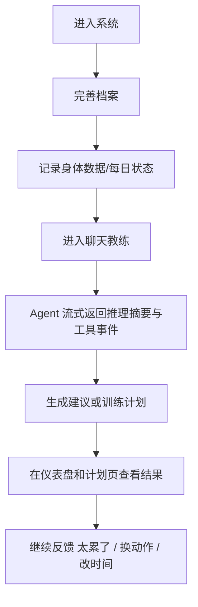

# 基于多智能体的智能健康与健身助手 Health Agent 项目报告

## 一、选题目的和意义

随着健康管理、体重控制和科学健身需求的持续增长，越来越多用户希望获得一种既能长期记录数据、又能给出可执行建议的产品体验。传统健康类产品常见的问题是记录入口分散、建议缺少上下文、计划难以随用户状态变化而调整；而纯聊天式 AI 产品又容易缺少结构化数据沉淀与稳定的执行闭环。

`Health Agent` 项目的目标，是构建一个面向日常健康管理与健身训练场景的智能助手系统，通过“结构化记录 + 智能体对话 + 周计划生成 + 外部工具调用”的组合，为普通用户提供更连续、更可解释、更容易坚持的健康与训练支持。

本课题的研究意义主要体现在以下几个方面：
- 面向真实使用场景，验证大语言模型与多智能体机制在健康和健身垂直领域的落地方式；
- 探索“聊天式入口 + 结构化界面”的产品形态，降低用户使用门槛；
- 形成一套可复用的前后端协作、事件流交互和安全边界设计方案，为后续产品化奠定基础。

## 二、研究内容、研究方法、技术路线及可行性分析

### 2.1 研究内容

本项目围绕一个可演示、可联调、可验收的 MVP 展开，核心研究内容包括：
- 用户健康档案与健康/训练数据管理；
- 多智能体对话系统设计与会话编排；
- 基于历史数据的恢复建议与训练计划生成；
- 地图等外部工具能力接入；
- 前端流式交互、结构化卡片渲染与多页面信息组织。

### 2.2 研究方法

项目采用“需求分析 + MVP 范围收敛 + 系统设计 + 原型实现 + 联调测试”的方法推进。

在需求分析阶段，重点识别用户最高频、最值得优先实现的任务；在设计阶段，将系统拆分为前端、后端和智能体服务三层；在实现阶段，优先完成聊天教练、仪表盘、当前训练计划、档案和记录表单等 MVP 页面；在测试阶段，通过前后端联调、SSE 事件流验证和真实外部 API 调用验证整体可用性。

### 2.3 技术路线

项目采用三层技术架构：
- 前端使用 `Next.js`，实现聊天页、仪表盘、当前训练计划、健康记录、动作库和个人档案等页面；
- 后端使用 `NestJS + Prisma + PostgreSQL`，提供用户、档案、日志、动作库和计划等结构化业务能力；
- 智能体服务使用 `Python + FastAPI`，承担多智能体编排、OpenAI-compatible LLM 调用、工具路由、会话持久化和 SSE 流式输出。

在智能体设计上，系统设置主代理与多个子代理，包括：
- `IntakeAgent`：负责首轮建档与补问；
- `TrendAnalystAgent`：负责趋势分析与恢复判断；
- `PlanAgent`：负责周计划生成与计划调整；
- `ExerciseCoachAgent`：负责动作推荐与替代动作建议；
- `SafetyAgent`：负责高风险内容识别与保守回复；
- `LocationAssistantAgent`：负责地图检索与健身房推荐。

### 2.4 MVP 产品策略

为了保证首版能快速跑通，我们将系统能力划分为“主闭环页面”和“支撑页面”两层：

| 层级 | 页面/能力 | 目标 |
| --- | --- | --- |
| P0 | 聊天教练 | 作为主入口，支持自然语言提问、SSE 流式反馈、工具调用展示和最终建议展示 |
| P0 | 仪表盘 | 展示体重趋势、训练完成率、恢复状态和今日重点，形成每日回访入口 |
| P0 | 当前训练计划 | 展示本周计划与“完成了 / 太累了 / 换动作 / 改时间”等快捷反馈入口 |
| P0 | 个人档案 | 支撑建档、目标设定、器械条件和限制条件维护 |
| P0 | 健康记录 | 作为高可靠兜底表单，补充体重、睡眠、步数、饮水和疲劳等结构化数据 |
| P1 | 动作库 | 作为 agent 推荐动作的稳定知识源 |
| P1 | 附近健身房查询 | 作为工具调用演示能力，增强场景真实性 |

这种划分可以保证首版前端先跑通一个完整闭环：建档 -> 记录 -> 提问/生成计划 -> 查看仪表盘与计划 -> 继续反馈调整。

### 2.5 可行性分析

本项目具备较高可行性，主要理由如下：
- 技术成熟：`Next.js`、`NestJS`、`FastAPI`、`PostgreSQL` 和 SSE 都是成熟方案；
- 范围可控：MVP 首版优先实现 5 个高价值页面，其余能力作为增强项逐步接入；
- 展示效果强：流式事件、结构化卡片和多页面联动能够形成清晰的演示效果；
- 风险边界明确：系统强调“健康管理与训练辅助”，不承担诊断和处方职责。

从当前主流产品实践看，恢复状态与训练趋势已经成为健康/运动产品的高频入口。Oura 与 Fitbit 都将 readiness/recovery 作为日常决策入口，Strava 则强调按周查看训练日志和趋势变化；WHO 也建议成年人每周进行至少 150 分钟中等强度活动以及每周 2 次以上力量训练。基于这些产品与健康建议的共同趋势，`Health Agent` 的 MVP 以前端可视化形式突出“恢复状态 + 周计划 + 实时问答”，方向明确且合理。

## 三、项目特色与创新点

本项目的特色与创新点主要包括：

1. 采用多智能体协同而不是单一问答模型，将健康建议、计划生成、动作推荐、安全控制和位置工具解耦。
2. 采用“聊天式主入口 + 结构化页面”的混合产品形态，既保留自然语言交互的低门槛，又保留稳定的业务数据沉淀。
3. 前端通过 `SSE` 流式展示 `thinking_summary`、工具调用状态、卡片渲染和最终回复，增强可解释性与互动感。
4. 将健康记录表单作为高可靠兜底入口，避免系统过度依赖模型理解用户输入。
5. MVP 即引入地图工具调用，能够展示智能体与外部世界连接的能力，而不仅仅是静态问答。

## 四、MVP 前端方案

### 4.1 前端视觉与交互定位

前端设计遵循“克制、可信、可操作”的原则，避免把系统做成纯营销型 landing page，也避免把工作台堆成密集卡片墙。页面结构采用侧边导航 + 主工作区的应用式布局，确保用户能在最短路径内完成查看状态、发起提问和调整计划。

### 4.2 核心前端交互闭环

MVP 的关键交互链路如下：

### 4.3 前端重点实现内容

- 聊天页：负责 thread 初始化、消息提交、事件流订阅、时间线显示和卡片区渲染；
- 仪表盘页：负责展示体重趋势、训练完成率、恢复状态和今日重点；
- 当前训练计划页：负责展示训练日卡片和计划反馈动作；
- 健康记录页：负责身体数据和每日状态表单录入；
- 个人档案页：负责目标和训练约束信息维护；
- 动作库页：负责以结构化信息展示动作名称、目标肌群、器械和要点。

## 五、进度安排

| 周次 | 阶段目标 | 交付物 |
| --- | --- | --- |
| 第 1 周 | 完成需求分析与 MVP 范围确认 | 需求说明书、页面优先级、系统总体架构 |
| 第 2-3 周 | 完成前端应用骨架和基础页面 | 侧边导航、聊天页、仪表盘、档案页、记录页 |
| 第 4-5 周 | 完成后端基础接口与数据库模型 | 用户、档案、日志、计划、动作库接口 |
| 第 6-8 周 | 完成智能体服务和 SSE 事件流 | 线程、消息、run、工具调用和流式输出 |
| 第 9-10 周 | 完成计划页、动作库和地图工具接入 | 当前训练计划页、动作库页、附近健身房查询 |
| 第 11-12 周 | 完成联调和体验优化 | 前后端联调、空状态/错误态处理、演示脚本 |
| 第 13-14 周 | 完成文档与展示材料 | 项目报告、系统设计说明书、需求规格说明书、答辩材料 |

## 六、成员名单、角色与任务分配

周兴煜（组长）：
负责项目整体规划、架构设计、任务协调与阶段验收，统筹前端、后端和智能体服务之间的协作关系。

张昶昶（前端）：
负责前端应用架构、导航与页面实现，重点完成聊天页、仪表盘、训练计划页、个人档案页和健康记录页；负责 SSE 流式可视化、事件时间线、卡片渲染和前后端联调。

张朝中（智能体基础设施）：
负责大语言模型接入、OpenAI-compatible 适配、线程与消息管理、运行日志、SSE 事件流和多智能体运行时实现。

龙逸翾（智能体业务与工具）：
负责健康建议、计划生成、动作推荐、安全控制和位置工具等业务代理的提示词与协作逻辑设计，同时负责地图 API 和内部工具路由的接入与测试。

## 七、参考产品与资料

- Oura Readiness Score: https://support.ouraring.com/hc/en-us/articles/360025589793-An-Introduction-to-Your-Readiness-Score
- Fitbit Readiness Score: https://support.google.com/fitbit/answer/14236710?hl=en
- Strava Training Log: https://support.strava.com/hc/en-us/articles/206535704-Training-Log
- Strava Progress Summary Chart: https://support.strava.com/hc/en-us/articles/28437860016141-Progress-Summary-Chart
- WHO Physical Activity: https://www.who.int/initiatives/behealthy/physical-activity

## 八、结论

`Health Agent` 并不追求在首版中覆盖所有健康管理场景，而是优先构建一个真实、清晰、可演示的 MVP。围绕“恢复判断、周计划、实时问答、结构化记录”这几个关键点，前端可以快速形成稳定的信息架构和展示闭环，后端与智能体服务也能围绕明确的数据和事件协议开展协作。这样的路线既适合课程项目落地，也为后续功能扩展保留了足够空间。
