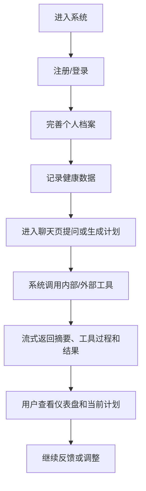
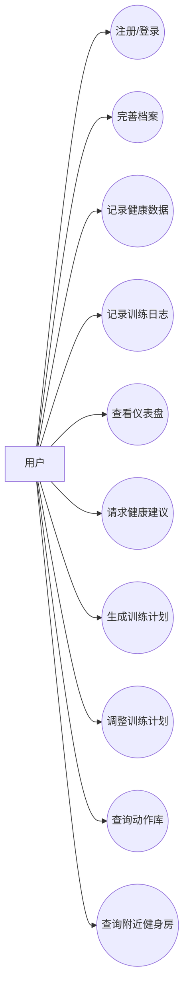
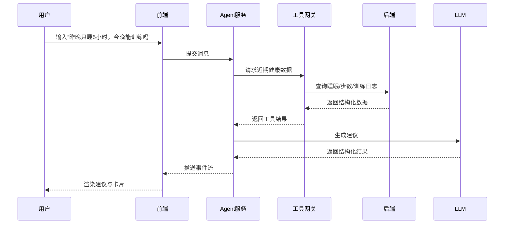
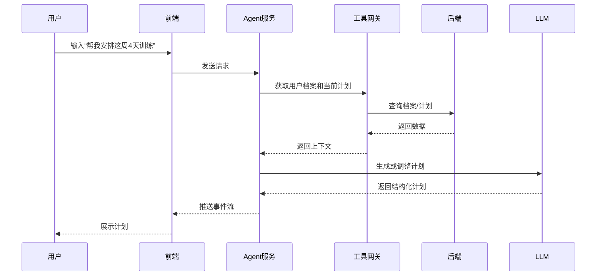
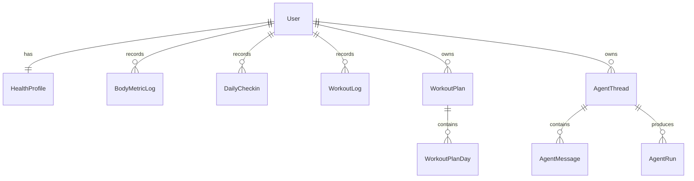

## **Health Agent 项目需求规格说明书**

## 一、项目概述

### 1.1 项目名称

**Health Agent 智能健康与健身助手系统**

### 1.2 项目背景

用户在健康与健身场景中的真实需求，通常不是单点问答，而是一个持续循环：建档、记录、理解自身状态、生成计划、根据反馈调整。现有产品往往只覆盖其中一部分，要么偏数据记录，要么偏聊天建议，难以形成稳定闭环。

`Health Agent` 希望解决的正是这个问题。系统通过整合结构化数据记录、聊天式智能体交互、训练计划生成和外部工具调用能力，为普通用户提供一个更自然、更可执行的健康与健身助手。

### 1.3 编写目的

本文档用于明确 `Health Agent` MVP 的需求范围、功能优先级、用户场景、验收标准、非功能性要求以及开发运行环境，为后续设计、开发、联调和验收提供统一依据。

### 1.4 项目目标

本项目的目标不是在首版中覆盖所有健康场景，而是先交付一个可运行、可展示、可迭代的 MVP。首版目标包括：
- 支持用户完成建档并记录核心健康数据；
- 支持通过聊天获取恢复建议、训练建议和训练计划；
- 支持展示智能体执行过程中的关键阶段；
- 支持在仪表盘查看今日重点和训练状态；
- 支持对当前训练计划进行快捷调整；
- 明确系统安全边界，避免输出医疗诊断和高风险建议。

## 二、MVP 范围定义

### 2.1 范围原则

MVP 以“先完成核心闭环”为原则，优先支持以下链路：

`建档 -> 记录 -> 聊天提问/生成计划 -> 查看仪表盘与计划 -> 继续反馈调整`

### 2.2 范围划分

| 优先级 | 能力 | 是否纳入 MVP |
| --- | --- | --- |
| Must | 账号登录/注册 | 是 |
| Must | 个人档案维护 | 是 |
| Must | 健康记录表单 | 是 |
| Must | 聊天式智能体 | 是 |
| Must | SSE 关键事件展示 | 是 |
| Must | 仪表盘快照 | 是 |
| Must | 当前训练计划展示 | 是 |
| Must | 计划快捷调整入口 | 是 |
| Should | 动作库查询 | 是 |
| Should | 附近健身房查询 | 是 |
| Could | 饮食分析、天气、日程工具 | 否，后续迭代 |
| Could | 可穿戴设备直连 | 否，后续迭代 |

### 2.3 延后实现内容

以下内容不属于当前 MVP 的承诺范围：
- 医疗诊断、处方建议、伤病康复方案；
- 自动同步手环/手表数据；
- 饮食识别、拍照识别、营养分析；
- 社交分享、排行榜、社区功能；
- 复杂长期训练周期管理。

## 三、用户需求说明

### 3.1 目标用户

本系统面向以下三类用户：
- 有日常健康管理需求的普通用户；
- 希望减脂塑形或规律训练的健身新手和初级训练者；
- 希望通过自然语言快速获取建议和计划的用户。

本系统不以专业医疗场景或职业运动员训练管理为首要目标。

### 3.2 用户核心需求

用户的核心需求可归纳为以下几点：
- 能方便地建立并维护自己的健康与训练档案；
- 能快速记录体重、睡眠、步数、饮水和训练情况；
- 能看懂自己的最近状态，而不是只看到零散数据；
- 能获得基于历史记录的个性化建议；
- 能自动生成一周训练计划，并在情况变化时快速调整；
- 能在问答之外看到系统做了什么，以增强信任感；
- 能通过动作库和地图工具获得更具体、更现实的支持。

### 3.3 典型用户故事

- 作为一名普通用户，我希望记录每天的体重和睡眠情况，并在状态不佳时知道今天是否更适合恢复。
- 作为一名减脂期用户，我希望系统为我生成本周训练计划，并在我临时没空时快速改动安排。
- 作为一名训练经验有限的用户，我希望看到动作要点和替代动作，而不是只看到模糊建议。
- 作为一名需要寻找训练场地的用户，我希望通过聊天直接获得附近健身房推荐。

### 3.4 用户业务流程

## 四、功能需求分析

### 4.1 优先级说明

- `P0`：MVP 必须实现，否则无法形成核心闭环；
- `P1`：增强体验的重要功能，建议在首版一并完成；
- `P2`：后续可扩展功能，不纳入当前验收。

### 4.2 P0 功能需求

#### 4.2.1 账号与档案管理

系统应支持用户注册、登录以及个人健康档案维护。档案信息至少包括年龄、身高、当前体重、目标体重、训练经验、每周可训练天数、器械条件和限制条件。

#### 4.2.2 健康数据记录

系统应支持用户记录以下核心数据：
- 身体指标：体重、体脂率、腰围；
- 每日状态：睡眠时长、步数、饮水量、疲劳等级；
- 训练记录：训练类型、时长、强度、疲劳反馈、疼痛备注。

#### 4.2.3 聊天式智能体

系统应支持用户通过自然语言输入问题，并触发一次智能体运行。智能体应能识别健康建议、训练计划、动作查询和附近健身房查询等意图。

#### 4.2.4 SSE 事件展示

当前 MVP 至少应支持以下事件：
- `thinking_summary`
- `tool_call_started`
- `tool_call_completed`
- `card_render`
- `final_message`

前端需要能以时间线或状态区的方式清晰展示这些事件。

#### 4.2.5 仪表盘

系统应提供仪表盘页面，至少展示以下信息：
- 体重趋势；
- 本周训练完成率；
- 恢复状态；
- 今日重点；
- 当前计划预览。

#### 4.2.6 当前训练计划

系统应支持查看当前 7 天计划，并展示每日训练重点、时长、动作列表和恢复提示。用户应能从页面触发至少四个快捷反馈动作：
- 完成了
- 太累了
- 换动作
- 改时间

#### 4.2.7 安全边界

若用户输入涉及明显疼痛、异常生理症状、极端减脂或医疗判断，系统应优先返回保守提示和就医建议，而不是继续输出具体训练或健康方案。

### 4.3 P1 功能需求

#### 4.3.1 动作库

系统应提供动作库查询能力，至少包括动作名称、目标肌群、器械要求、难度等级、动作要点和替代建议。

#### 4.3.2 附近健身房查询

系统应支持通过地图工具查询附近健身房，并返回名称、距离、地址和推荐理由等基础信息。

## 五、前端需求与验收标准

### 5.1 页面级要求

| 页面 | 验收标准 |
| --- | --- |
| 聊天页 | 能创建线程、发送消息、显示运行状态、展示事件时间线、渲染卡片和最终回复 |
| 仪表盘 | 能展示至少 4 项核心状态信息，并提供计划预览 |
| 当前训练计划页 | 能展示每日训练信息，并提供 4 个快捷反馈按钮 |
| 健康记录页 | 能录入身体数据和每日状态，具备基本表单可用性 |
| 个人档案页 | 能维护目标和训练约束信息 |
| 动作库页 | 能展示结构化动作信息 |

### 5.2 交互要求

- 聊天页中，用户在发送消息后应立即看到“处理中”反馈；
- SSE 事件到达后，页面应逐步更新状态，而不是只在最后一次性展示；
- 当流式结果异常中断时，前端应给出明确错误提示并尽量使用已有结果兜底；
- 表单页必须包含空状态、保存中状态和错误提示；
- 页面需要支持移动端基本浏览和操作。

### 5.3 界面体验要求

前端视觉与布局遵循以下原则：
- 整体风格应偏“专业应用”而不是“营销落地页”；
- 页面结构应让用户能一眼找到当前任务和下一步动作；
- 避免无意义卡片堆叠，卡片只用于承载清晰的独立信息块；
- 聊天页、仪表盘页和计划页需要形成统一的信息层次。

## 六、需求分析建模

### 6.1 用例分析

系统核心用例包括：
- 注册/登录；
- 完善档案；
- 记录健康数据；
- 记录训练日志；
- 查看仪表盘；
- 请求健康建议；
- 生成训练计划；
- 调整训练计划；
- 查询动作库；
- 查询附近健身房。

### 6.2 用例图

### 6.3 时序图一：健康建议生成

### 6.4 时序图二：训练计划生成与调整

## 七、数据建模

### 7.1 数据实体说明

系统中的主要实体包括：
- 用户；
- 健康档案；
- 身体指标记录；
- 每日打卡记录；
- 训练日志；
- 训练计划；
- 训练日明细；
- 动作库；
- 会话线程；
- 会话消息；
- 运行记录。

### 7.2 ER 图

## 八、非功能性需求说明

### 8.1 性能需求

- 普通页面应在合理时间内返回可见内容；
- 聊天运行应支持流式反馈，避免用户长时间无感知等待；
- 外部工具超时或失败时，系统应尽快返回提示而非无限等待。

### 8.2 安全性需求

- 用户密码必须哈希存储；
- 数据库连接、模型密钥和地图密钥必须通过环境变量管理；
- 系统必须明确不提供诊断、药物建议和极端减脂指导。

### 8.3 可用性需求

- 页面必须覆盖空状态、加载态、成功态和错误态；
- 用户应能明确知道当前系统是否正在执行、执行到了哪一步；
- 核心交互需要兼顾桌面端和移动端基本可用性。

### 8.4 可维护性需求

- 前端、后端和智能体服务需保持分层；
- 关键接口字段和事件名应尽量稳定；
- 系统应保留运行日志与会话记录，便于排查问题。

### 8.5 可靠性需求

- 大模型不可用时，系统应支持基础回退；
- SSE 中断时，前端应能回退到已有返回结果；
- 工具调用失败时，应返回可理解的提示信息。

## 九、开发环境与运行环境

### 9.1 开发环境

本项目开发环境包括：
- Windows 11
- Visual Studio Code
- Node.js 20.x
- npm 10.x 及以上
- Python 3.10 及以上
- PostgreSQL

### 9.2 运行环境

系统运行时使用：
- `Next.js` 作为前端框架；
- `NestJS` 作为后端业务框架；
- `FastAPI` 作为智能体服务框架；
- `Prisma` 负责数据库访问；
- `PostgreSQL` 负责数据持久化；
- REST API 和 SSE 作为主要通信方式。

## 十、系统依赖项

系统依赖的软件与服务包括：
- React
- Next.js
- NestJS
- Prisma
- PostgreSQL
- FastAPI
- OpenAI-compatible LLM 服务
- 地图 API 服务

## 十一、验收结论标准

满足以下条件时，可视为 MVP 基本达成：
- 用户可以完成建档和基础数据录入；
- 聊天页可以真实触发一次智能体运行并看到流式过程；
- 仪表盘可以展示与训练决策直接相关的核心状态；
- 训练计划页可以展示当前计划并支持快捷反馈；
- 系统对高风险输入采取保守策略；
- 前后端和智能体服务之间可以完成基本联调。
